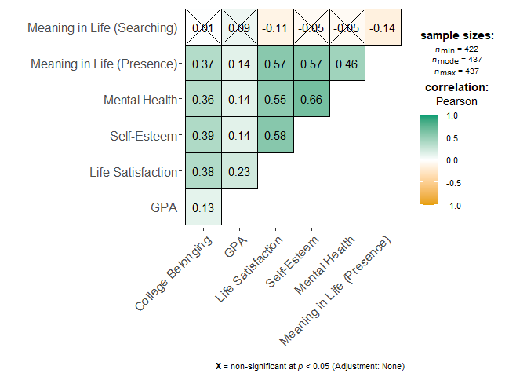

correlation matrix and tables
================
Colin Li
2/16/2023

# Nice Looking Tables

``` r
library(haven)
library(formattable)
library(data.table)
library(tidyverse)
```

    ## ── Attaching packages ─────────────────────────────────────── tidyverse 1.3.2 ──
    ## ✔ ggplot2 3.4.0      ✔ purrr   0.3.5 
    ## ✔ tibble  3.1.8      ✔ dplyr   1.0.10
    ## ✔ tidyr   1.2.1      ✔ stringr 1.5.0 
    ## ✔ readr   2.1.3      ✔ forcats 0.5.2 
    ## ── Conflicts ────────────────────────────────────────── tidyverse_conflicts() ──
    ## ✖ dplyr::between()   masks data.table::between()
    ## ✖ dplyr::filter()    masks stats::filter()
    ## ✖ dplyr::first()     masks data.table::first()
    ## ✖ dplyr::lag()       masks stats::lag()
    ## ✖ dplyr::last()      masks data.table::last()
    ## ✖ purrr::transpose() masks data.table::transpose()

``` r
library(dplyr)
library(knitr)
library(kableExtra)
```

    ## 
    ## Attaching package: 'kableExtra'
    ## 
    ## The following object is masked from 'package:dplyr':
    ## 
    ##     group_rows

``` r
fit <- read_csv("C:/Users/Colin/Documents/socfit.csv")
```

    ## Rows: 3 Columns: 8
    ## ── Column specification ────────────────────────────────────────────────────────
    ## Delimiter: ","
    ## chr (1): Model
    ## dbl (7): Number of Parameters, Chi-Square, Degrees of Freedom, P-Value, CFI,...
    ## 
    ## ℹ Use `spec()` to retrieve the full column specification for this data.
    ## ℹ Specify the column types or set `show_col_types = FALSE` to quiet this message.

``` r
customGreen0 = "#DeF7E9"

customGreen = "#71CA97"

formattable(fit, align =c("l","c", "c", "c", "c","c","c","r"), list(
  `Model` = formatter("span", style = ~ formattable::style(color = "black", font.weight = "bold"), x ~ icontext(ifelse(x != "", "thumbs-up", ""), x)), 
  `Chi-Square`= color_tile(customGreen0, customGreen), 
  `P-Value`= color_tile(customGreen, customGreen0)))
```

<table class="table table-condensed">
<thead>
<tr>
<th style="text-align:left;">
Model
</th>
<th style="text-align:center;">
Number of Parameters
</th>
<th style="text-align:center;">
Chi-Square
</th>
<th style="text-align:center;">
Degrees of Freedom
</th>
<th style="text-align:center;">
P-Value
</th>
<th style="text-align:center;">
CFI
</th>
<th style="text-align:center;">
RMESA
</th>
<th style="text-align:right;">
SRMR
</th>
</tr>
</thead>
<tbody>
<tr>
<td style="text-align:left;">
<span style="color: black; font-weight: bold">
<i class="glyphicon glyphicon-thumbs-up"></i> Configural </span>
</td>
<td style="text-align:center;">
26
</td>
<td style="text-align:center;">
<span
style="display: block; padding: 0 4px; border-radius: 4px; background-color: #def7e9">3.95</span>
</td>
<td style="text-align:center;">
2
</td>
<td style="text-align:center;">
<span
style="display: block; padding: 0 4px; border-radius: 4px; background-color: #71ca97">0.14</span>
</td>
<td style="text-align:center;">
0.998
</td>
<td style="text-align:center;">
0.07
</td>
<td style="text-align:right;">
0.01
</td>
</tr>
<tr>
<td style="text-align:left;">
<span style="color: black; font-weight: bold">
<i class="glyphicon glyphicon-thumbs-up"></i> Metric </span>
</td>
<td style="text-align:center;">
23
</td>
<td style="text-align:center;">
<span
style="display: block; padding: 0 4px; border-radius: 4px; background-color: #91d7af">7.64</span>
</td>
<td style="text-align:center;">
5
</td>
<td style="text-align:center;">
<span
style="display: block; padding: 0 4px; border-radius: 4px; background-color: #87d3a8">0.18</span>
</td>
<td style="text-align:center;">
0.998
</td>
<td style="text-align:center;">
0.05
</td>
<td style="text-align:right;">
0.04
</td>
</tr>
<tr>
<td style="text-align:left;">
<span style="color: black; font-weight: bold">
<i class="glyphicon glyphicon-thumbs-up"></i> Scalar </span>
</td>
<td style="text-align:center;">
20
</td>
<td style="text-align:center;">
<span
style="display: block; padding: 0 4px; border-radius: 4px; background-color: #71ca97">9.19</span>
</td>
<td style="text-align:center;">
8
</td>
<td style="text-align:center;">
<span
style="display: block; padding: 0 4px; border-radius: 4px; background-color: #def7e9">0.33</span>
</td>
<td style="text-align:center;">
0.990
</td>
<td style="text-align:center;">
0.03
</td>
<td style="text-align:right;">
0.05
</td>
</tr>
</tbody>
</table>

``` r
fi2 <- read_csv("C:/Users/Colin/Documents/semfit.csv")
```

    ## Rows: 3 Columns: 8
    ## ── Column specification ────────────────────────────────────────────────────────
    ## Delimiter: ","
    ## chr (1): Model
    ## dbl (7): Number of Parameters, Chi-Square, Degrees of Freedom, P-Value, CFI,...
    ## 
    ## ℹ Use `spec()` to retrieve the full column specification for this data.
    ## ℹ Specify the column types or set `show_col_types = FALSE` to quiet this message.

``` r
formattable(fi2, align =c("l","c", "c", "c", "c","c","c","r"), list(
  `Model` = formatter("span", style = ~ formattable::style(color = "black", font.weight = "bold"), x ~ icontext(ifelse(x != "", "thumbs-up", ""), x)), 
  `Chi-Square`= color_tile(customGreen0, customGreen), 
  `P-Value`= color_tile(customGreen, customGreen0)))
```

<table class="table table-condensed">
<thead>
<tr>
<th style="text-align:left;">
Model
</th>
<th style="text-align:center;">
Number of Parameters
</th>
<th style="text-align:center;">
Chi-Square
</th>
<th style="text-align:center;">
Degrees of Freedom
</th>
<th style="text-align:center;">
P-Value
</th>
<th style="text-align:center;">
CFI
</th>
<th style="text-align:center;">
RMESA
</th>
<th style="text-align:right;">
SRMR
</th>
</tr>
</thead>
<tbody>
<tr>
<td style="text-align:left;">
<span style="color: black; font-weight: bold">
<i class="glyphicon glyphicon-thumbs-up"></i> Configural </span>
</td>
<td style="text-align:center;">
26
</td>
<td style="text-align:center;">
<span
style="display: block; padding: 0 4px; border-radius: 4px; background-color: #def7e9">2.01</span>
</td>
<td style="text-align:center;">
2
</td>
<td style="text-align:center;">
<span
style="display: block; padding: 0 4px; border-radius: 4px; background-color: #71ca97">0.37</span>
</td>
<td style="text-align:center;">
1
</td>
<td style="text-align:center;">
0.006
</td>
<td style="text-align:right;">
0.006
</td>
</tr>
<tr>
<td style="text-align:left;">
<span style="color: black; font-weight: bold">
<i class="glyphicon glyphicon-thumbs-up"></i> Metric </span>
</td>
<td style="text-align:center;">
23
</td>
<td style="text-align:center;">
<span
style="display: block; padding: 0 4px; border-radius: 4px; background-color: #cbefda">2.89</span>
</td>
<td style="text-align:center;">
5
</td>
<td style="text-align:center;">
<span
style="display: block; padding: 0 4px; border-radius: 4px; background-color: #def7e9">0.72</span>
</td>
<td style="text-align:center;">
1
</td>
<td style="text-align:center;">
0.000
</td>
<td style="text-align:right;">
0.018
</td>
</tr>
<tr>
<td style="text-align:left;">
<span style="color: black; font-weight: bold">
<i class="glyphicon glyphicon-thumbs-up"></i> Scalar </span>
</td>
<td style="text-align:center;">
20
</td>
<td style="text-align:center;">
<span
style="display: block; padding: 0 4px; border-radius: 4px; background-color: #71ca97">7.10</span>
</td>
<td style="text-align:center;">
8
</td>
<td style="text-align:center;">
<span
style="display: block; padding: 0 4px; border-radius: 4px; background-color: #a2debc">0.53</span>
</td>
<td style="text-align:center;">
1
</td>
<td style="text-align:center;">
0.000
</td>
<td style="text-align:right;">
0.030
</td>
</tr>
</tbody>
</table>

# Correlation Matrix

``` r
library(ggplot2)
library(corrplot)
```

    ## corrplot 0.92 loaded

``` r
library(ggstatsplot)
```

    ## You can cite this package as:
    ##      Patil, I. (2021). Visualizations with statistical details: The 'ggstatsplot' approach.
    ##      Journal of Open Source Software, 6(61), 3167, doi:10.21105/joss.03167

``` r
library(ggsci)
library(ggcorrplot)

co <- read_sav("C:/Users/Colin/Documents/belong2.sav")

corr <- cor(co, use = "pairwise")


#testRes = cor.mtest(co, conf.level = 0.95)

#corrplot(corr, method="color", col=col(200),  type="upper", order="hclust", addCoef.col = "black", tl.col="black", tl.srt=45, sig.level = 0.01, insig = "blank", diag=FALSE)

ggcorrmat(co, cor.vars = c(Belonging, gpa, swl, se, mh, mil_pre, mil_search), 
  cor.vars.names = c(
    "College Belonging",
    "GPA",
    "Life Satisfaction",
    "Self-Esteem",
    "Mental Health",
    "Meaning in Life (Presence)",
    "Meaning in Life (Searching)"), p.adjust.method = "none")
```

<!-- -->

``` r
col <- colorRampPalette(c("#BB4444", "#EE9988", "#FFFFFF", "#77AADD", "#4477AA"))


colors <- c('#E64B35FF',    '#4DBBD5FF',    '#00A087FF',    '#3C5488FF',
'#F39B7FFF',    '#8491B4FF', '#91D1C2FF',   '#DC0000FF',    
'#7E6148FF',    '#B09C85FF')


ggcorrplot(corr,
  type = "upper",
  insig = "blank",
  lab = TRUE,
  digits = 2, colors = c("#E69F00", "white", "#009E73"), ggtheme=ggstatsplot::theme_ggstatsplot())
```

<!-- -->
