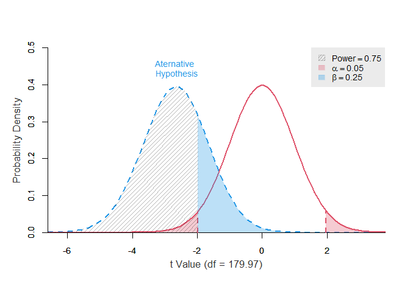
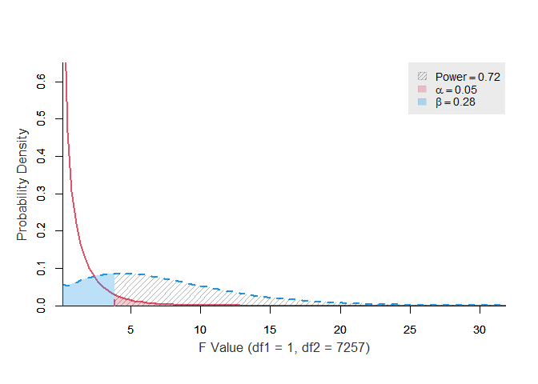

Portfolio 6 Power
================
Colin Li
3/28/2023

``` r
library(pwrss)
```

    ## Warning: package 'pwrss' was built under R version 4.2.3

    ## 
    ## Attaching package: 'pwrss'

    ## The following object is masked from 'package:stats':
    ## 
    ##     power.t.test

``` r
library(haven)
```

    ## Warning: package 'haven' was built under R version 4.2.3

``` r
library(tidyverse)
```

    ## Warning: package 'tidyverse' was built under R version 4.2.3

    ## Warning: package 'ggplot2' was built under R version 4.2.3

    ## Warning: package 'tibble' was built under R version 4.2.3

    ## Warning: package 'tidyr' was built under R version 4.2.3

    ## Warning: package 'readr' was built under R version 4.2.3

    ## Warning: package 'purrr' was built under R version 4.2.3

    ## Warning: package 'dplyr' was built under R version 4.2.3

    ## Warning: package 'forcats' was built under R version 4.2.3

    ## Warning: package 'lubridate' was built under R version 4.2.3

    ## ── Attaching core tidyverse packages ──────────────────────── tidyverse 2.0.0 ──
    ## ✔ dplyr     1.1.1     ✔ readr     2.1.4
    ## ✔ forcats   1.0.0     ✔ stringr   1.5.0
    ## ✔ ggplot2   3.4.1     ✔ tibble    3.2.1
    ## ✔ lubridate 1.9.2     ✔ tidyr     1.3.0
    ## ✔ purrr     1.0.1

    ## ── Conflicts ────────────────────────────────────────── tidyverse_conflicts() ──
    ## ✖ dplyr::filter() masks stats::filter()
    ## ✖ dplyr::lag()    masks stats::lag()
    ## ℹ Use the conflicted package (<http://conflicted.r-lib.org/>) to force all conflicts to become errors

``` r
Adata <- read_sav("C:/Users/Colin/Documents/GitHub/Colin_portfolio/p02/data/AQ.sav")
Bd <- Adata %>% 
  filter(Asian == "1")

t.test(Bd$Asian_Warmth~Bd$Conditions)
```

    ## 
    ##  Welch Two Sample t-test
    ## 
    ## data:  Bd$Asian_Warmth by Bd$Conditions
    ## t = -2.6589, df = 179.97, p-value = 0.008547
    ## alternative hypothesis: true difference in means between group Ingroup and group Outgroup is not equal to 0
    ## 95 percent confidence interval:
    ##  -0.9720587 -0.1438833
    ## sample estimates:
    ##  mean in group Ingroup mean in group Outgroup 
    ##               7.108696               7.666667

I found a cool package that can visualize power as long as you provide
the testing statistics and df. The red curve shows the null hypothesis,
whereas the blue curve shows the alternative hypothesis. I wish I could
change the legend theme, but I tried the code that works for ggplot
won’t work for this plot.

``` r
power.t.test(ncp = -2.6589, df = 179.97, alpha = 0.05, alternative = "not equal") 
```

<!-- -->

    ##      power ncp.alt ncp.null alpha     df  t.crit.1 t.crit.2
    ##  0.7532427  -2.659        0  0.05 179.97 -1.973233 1.973233

below is another plot where I ran planned contrast. Again, this is
useful because published papers all have to show these statistics, so we
can visualize their power whenever we want.

``` r
power.f.test(ncp = 6.49, df1 = 1, df2 = 7257, alpha = 0.05, plot = TRUE)
```

<!-- -->

    ##      power ncp.alt ncp.null alpha df1  df2   f.crit
    ##  0.7214843    6.49        0  0.05   1 7257 3.842741
