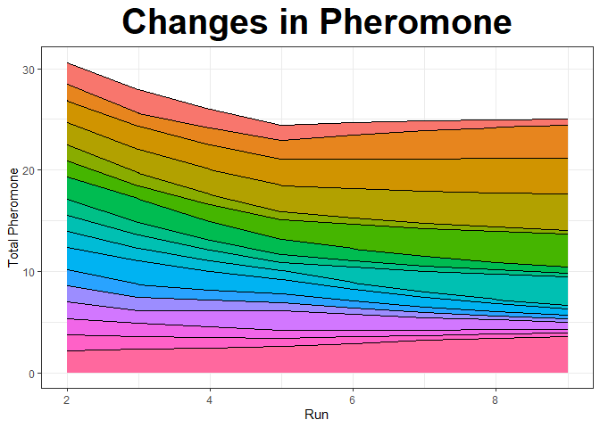

Portfolio 7 Ant Colony Optimization
================
Colin Li
3/28/2023

Background: My thesis is a scale development project where in study 1 I
used IRT and CFA to select best 6 belonging items from a pool of items.
These are traditional psychometric approaches to creating short scales.
But I heard there are modern machine learning algorithms can do that.
Ant Colony Optimization is one of them. So I wanted to see if using this
method would result in the same 6 items that we selected from using the
traditional psychometric methods.

``` r
library(ShortForm)
```

    ## Package 'ShortForm' version 0.5.2

``` r
library(haven)
```

    ## Warning: package 'haven' was built under R version 4.2.3

``` r
ant <- read_sav("C:/Users/Colin/Documents/ant.sav")
```

``` r
antModel = ' Belong =~ Bi1 + BiBPS + Bi3 + Bi9 + Bi11 + Bi12 + Bi15 + Bi16 + Bi17 + Bi18 + Bi23 + Bi24 + Bi26 + Bi27 + Bi28 + Bi29 + Bi30 +'

list.items <- 
  list(c(
  "Bi1",
"BiBPS",
"Bi3",
"Bi9",
"Bi11",
"Bi12",
"Bi15",
"Bi16",
"Bi17",
"Bi18",
"Bi23",
"Bi24",
"Bi26",
"Bi27",
"Bi28",
"Bi29",
"Bi30"))

abilityShortForm <- antcolony.lavaan(
  data = ant,
  ants = 20, evaporation = 0.8, antModel = antModel,
  list.items = list.items, full = 17, i.per.f = 6,
  factors = "Belong", steps = 50, fit.indices = c("cfi", "tli", "rmsea", "srmr"),
  fit.statistics.test = "(cfi > 0.95)&(tli > 0.95)&(rmsea < 0.06)&(srmr<0.08)",  
                   max.run = 1000)
```

    ##  Run number 1 and ant number 1.            Run number 1 and ant number 2.            Run number 1 and ant number 3.            Run number 1 and ant number 4.            Run number 1 and ant number 5.            Run number 1 and ant number 6.            Run number 1 and ant number 7.            Run number 1 and ant number 8.            Run number 1 and ant number 9.            Run number 1 and ant number 10.            Run number 1 and ant number 11.            Run number 1 and ant number 12.            Run number 1 and ant number 13.            Run number 1 and ant number 14.            Run number 1 and ant number 15.            Run number 1 and ant number 16.            Run number 1 and ant number 17.            Run number 1 and ant number 18.            Run number 1 and ant number 19.            Run number 1 and ant number 20.            Run number 2 and ant number 1.            Run number 2 and ant number 2.            Run number 2 and ant number 3.            Run number 2 and ant number 4.            Run number 2 and ant number 5.            Run number 2 and ant number 6.            Run number 2 and ant number 7.            Run number 2 and ant number 8.            Run number 2 and ant number 9.            Run number 2 and ant number 10.            Run number 2 and ant number 11.            Run number 2 and ant number 12.            Run number 2 and ant number 13.            Run number 2 and ant number 14.            Run number 2 and ant number 15.            Run number 2 and ant number 16.            Run number 2 and ant number 17.            Run number 2 and ant number 18.            Run number 2 and ant number 19.            Run number 2 and ant number 20.            Run number 3 and ant number 1.            Run number 3 and ant number 2.            Run number 3 and ant number 3.            Run number 3 and ant number 4.            Run number 3 and ant number 5.            Run number 3 and ant number 6.            Run number 3 and ant number 7.            Run number 3 and ant number 8.            Run number 3 and ant number 9.            Run number 3 and ant number 10.            Run number 3 and ant number 11.            Run number 3 and ant number 12.            Run number 3 and ant number 13.            Run number 3 and ant number 14.            Run number 3 and ant number 15.            Run number 3 and ant number 16.            Run number 3 and ant number 17.            Run number 3 and ant number 18.            Run number 3 and ant number 19.            Run number 3 and ant number 20.            Run number 4 and ant number 1.            Run number 4 and ant number 2.            Run number 4 and ant number 3.            Run number 4 and ant number 4.            Run number 4 and ant number 5.            Run number 4 and ant number 6.            Run number 4 and ant number 7.            Run number 4 and ant number 8.            Run number 4 and ant number 9.            Run number 4 and ant number 10.            Run number 4 and ant number 11.            Run number 4 and ant number 12.            Run number 4 and ant number 13.            Run number 4 and ant number 14.            Run number 4 and ant number 15.            Run number 4 and ant number 16.            Run number 4 and ant number 17.            Run number 4 and ant number 18.            Run number 4 and ant number 19.            Run number 4 and ant number 20.            Run number 5 and ant number 1.            Run number 5 and ant number 2.            Run number 5 and ant number 3.            Run number 5 and ant number 4.            Run number 5 and ant number 5.            Run number 5 and ant number 6.            Run number 5 and ant number 7.            Run number 5 and ant number 8.            Run number 5 and ant number 9.            Run number 5 and ant number 10.            Run number 5 and ant number 11.            Run number 5 and ant number 12.            Run number 5 and ant number 13.            Run number 5 and ant number 14.            Run number 5 and ant number 15.            Run number 5 and ant number 16.            Run number 5 and ant number 17.            Run number 5 and ant number 18.            Run number 5 and ant number 19.            Run number 5 and ant number 20.            Run number 6 and ant number 1.            Run number 6 and ant number 2.            Run number 6 and ant number 3.            Run number 6 and ant number 4.            Run number 6 and ant number 5.            Run number 6 and ant number 6.            Run number 6 and ant number 7.            Run number 6 and ant number 8.            Run number 6 and ant number 9.            Run number 6 and ant number 10.            Run number 6 and ant number 11.            Run number 6 and ant number 12.            Run number 6 and ant number 13.            Run number 6 and ant number 14.            Run number 6 and ant number 15.            Run number 6 and ant number 16.            Run number 6 and ant number 17.            Run number 6 and ant number 18.            Run number 6 and ant number 19.            Run number 6 and ant number 20.            Run number 7 and ant number 1.            Run number 7 and ant number 2.            Run number 7 and ant number 3.            Run number 7 and ant number 4.            Run number 7 and ant number 5.            Run number 7 and ant number 6.            Run number 7 and ant number 7.            Run number 7 and ant number 8.            Run number 7 and ant number 9.            Run number 7 and ant number 10.            Run number 7 and ant number 11.            Run number 7 and ant number 12.            Run number 7 and ant number 13.            Run number 7 and ant number 14.            Run number 7 and ant number 15.            Run number 7 and ant number 16.            Run number 7 and ant number 17.            Run number 7 and ant number 18.            Run number 7 and ant number 19.            Run number 7 and ant number 20.            Run number 8 and ant number 1.            Run number 8 and ant number 2.            Run number 8 and ant number 3.            Run number 8 and ant number 4.            Run number 8 and ant number 5.            Run number 8 and ant number 6.            Run number 8 and ant number 7.            Run number 8 and ant number 8.            Run number 8 and ant number 9.            Run number 8 and ant number 10.            Run number 8 and ant number 11.            Run number 8 and ant number 12.            Run number 8 and ant number 13.            Run number 8 and ant number 14.            Run number 8 and ant number 15.            Run number 8 and ant number 16.            Run number 8 and ant number 17.            Run number 8 and ant number 18.            Run number 8 and ant number 19.            Run number 8 and ant number 20.           [1] "Compiling results."

``` r
abilityShortForm
```

    ## Algorithm: Ant Colony Optimization
    ## Total Run Time: 18.992 secs
    ## 
    ## Function call:
    ## antcolony.lavaan(data = ant, ants = 20, evaporation = 0.8, antModel = antModel,
    ##   list.items = list.items, full = 17, i.per.f = 6, factors = "Belong", steps
    ##   = 50, fit.indices = c("cfi", "tli", "rmsea", "srmr"), fit.statistics.test =
    ##   "(cfi > 0.95)&(tli > 0.95)&(rmsea < 0.06)&(srmr<0.08)", max.run = 1000)
    ## 
    ## Final Model Syntax:
    ## Belong =~ BiBPS + Bi15 + Bi11 + Bi24 + Bi12 + Bi17

``` r
plot(abilityShortForm, type = 'pheromone')
```

<!-- --> Conclusion: I
still don’t quite understand how to set up all the parameters. And not
sure whether this method is superior than traditional psychometric
approaches. But 5 out of the resulting 6 items are the same as what we
got by using CFA & IRT.
