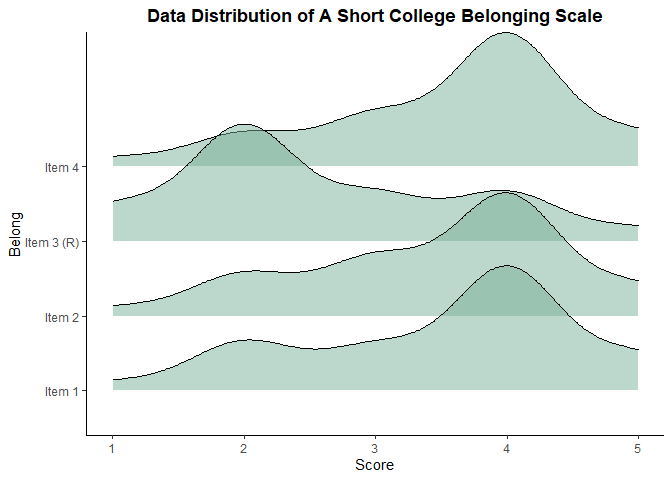

Portfolio 8 some hisograms
================
Colin Li
4/13/2023

Background: I’m told that it is helpful to look at each item’s histogram
when creating a scale.

``` r
library(psych)
```

    ## Warning: package 'psych' was built under R version 4.2.3

``` r
library(ggplot2)
```

    ## Warning: package 'ggplot2' was built under R version 4.2.3

    ## 
    ## Attaching package: 'ggplot2'

    ## The following objects are masked from 'package:psych':
    ## 
    ##     %+%, alpha

``` r
library(haven)
```

    ## Warning: package 'haven' was built under R version 4.2.3

``` r
library(data.table)
```

    ## Warning: package 'data.table' was built under R version 4.2.3

``` r
library(ggridges)
```

    ## Warning: package 'ggridges' was built under R version 4.2.3

``` r
library(ggsci)
```

    ## Warning: package 'ggsci' was built under R version 4.2.3

``` r
Be <- read_sav("C:/Users/Colin/Documents/PO8.sav")

multi.hist(Be[,sapply(Be, is.numeric)], freq = TRUE, bcol = "#79af97", breaks = 15, main = c("Item 1", "Item 2", "Item 3 (R)", "Item 4"))
```

<!-- -->

``` r
ggplot(Be, aes(x = Be1)) + geom_histogram(fill = "#79af97", color = "black") + theme_classic() + labs(title = "Item 1") + theme(plot.title = element_text(face = "bold", hjust = 0.5), axis.title.x = element_blank(), axis.title.y = element_blank()) 
```

    ## Don't know how to automatically pick scale for object of type
    ## <haven_labelled/vctrs_vctr/double>. Defaulting to continuous.
    ## `stat_bin()` using `bins = 30`. Pick better value with `binwidth`.

<!-- -->

``` r
ggplot(Be, aes(x = Be2)) + geom_histogram(fill = "#79af97", color = "black") + theme_classic() + labs(title = "Item 2", xlab = "") + theme(plot.title = element_text(face = "bold", hjust = 0.5), axis.title.x = element_blank(), axis.title.y = element_blank()) 
```

    ## Don't know how to automatically pick scale for object of type
    ## <haven_labelled/vctrs_vctr/double>. Defaulting to continuous.
    ## `stat_bin()` using `bins = 30`. Pick better value with `binwidth`.

<!-- -->

``` r
ggplot(Be, aes(x = BeR)) + geom_histogram(fill = "#79af97", color = "black") + theme_classic() + labs(title = "Item 3 (R)", xlab = "") + theme(plot.title = element_text(face = "bold", hjust = 0.5), axis.title.x = element_blank(), axis.title.y = element_blank()) 
```

    ## Don't know how to automatically pick scale for object of type
    ## <haven_labelled/vctrs_vctr/double>. Defaulting to continuous.
    ## `stat_bin()` using `bins = 30`. Pick better value with `binwidth`.

<!-- -->

``` r
ggplot(Be, aes(x = Be3)) + geom_histogram(fill = "#79af97", color = "black") + theme_classic() + labs(title = "Item 4", xlab = "") + theme(plot.title = element_text(face = "bold", hjust = 0.5), axis.title.x = element_blank(), axis.title.y = element_blank()) 
```

    ## Don't know how to automatically pick scale for object of type
    ## <haven_labelled/vctrs_vctr/double>. Defaulting to continuous.
    ## `stat_bin()` using `bins = 30`. Pick better value with `binwidth`.

<!-- -->

I would like to draw a normal curve for each histogram but it looks like
I have to change it to density plot first.

``` r
Be_A <- melt(Be, measure.vars = c("Be1","Be2","BeR", "Be3"),
     variable.name = "Belong", value.name="Score")
```

    ## Warning in melt(Be, measure.vars = c("Be1", "Be2", "BeR", "Be3"), variable.name
    ## = "Belong", : The melt generic in data.table has been passed a tbl_df and will
    ## attempt to redirect to the relevant reshape2 method; please note that reshape2
    ## is deprecated, and this redirection is now deprecated as well. To continue
    ## using melt methods from reshape2 while both libraries are attached, e.g.
    ## melt.list, you can prepend the namespace like reshape2::melt(Be). In the next
    ## version, this warning will become an error.

    ## Warning: attributes are not identical across measure variables; they will be
    ## dropped

``` r
Be_A$Belong <- factor(Be_A$Belong, levels = c("Be1", "Be2", "BeR", "Be3"),
                  labels = c("Item 1", "Item 2", "Item 3 (R)", "Item 4")
                  )
 
ggplot(Be_A, aes(x = Score)) + geom_histogram(fill = "#79af97", color = "black") + theme_classic() + theme(plot.title = element_text(face = "bold", hjust = 0.5), axis.title.x = element_blank(), axis.title.y = element_blank()) + facet_wrap(~ Belong) + theme(strip.background = element_blank(), strip.text = element_text(size = 10, face = "bold"))
```

    ## `stat_bin()` using `bins = 30`. Pick better value with `binwidth`.

<!-- -->

``` r
ggplot(Be_A, aes(x = Score, y = Belong, fill = stat(x))) +
  geom_density_ridges_gradient(bandwidth = 0.4) +
  scale_fill_gradient(name = "Range") + coord_cartesian(clip = "off") +
  theme_classic() + scale_x_continuous(limit = c(1, 5)) 
```

    ## Warning: `stat(x)` was deprecated in ggplot2 3.4.0.
    ## ℹ Please use `after_stat(x)` instead.
    ## This warning is displayed once every 8 hours.
    ## Call `lifecycle::last_lifecycle_warnings()` to see where this warning was
    ## generated.

<!-- --> It’s cool to
have all the density plot together but then I feel like the continuous
scale is kinda useless, i.e., the color change means nothing really. I
was also having trouble of naming the legend.

``` r
ggplot(Be_A, aes(x = Score, y = Belong, fill = stat(x))) + geom_density_ridges_gradient(bandwidth = 0.4) +
  scale_fill_viridis_c(name = "Range", limits=c(1, 5), breaks=seq(1,5,by=1))  + coord_cartesian(clip = "off") +
  theme_classic() + scale_x_continuous(limit = c(1, 5)) + labs(title = "Data Distribution of A Short Belonging Scale") + theme(plot.title = element_text(face = "bold", hjust = 0.5))
```

<!-- --> I really like
the final look.

``` r
ggplot(Be_A, aes(x = Score, y = Belong, fill = Belong)) +   geom_density_ridges(fill = "#79af97", alpha = 0.5, bandwidth = 0.4) +
  theme_classic() + scale_x_continuous(limit = c(1, 5)) + labs(title = "Data Distribution of A Short Belonging Scale") + theme(plot.title = element_text(face = "bold", hjust = 0.5))
```

<!-- -->
