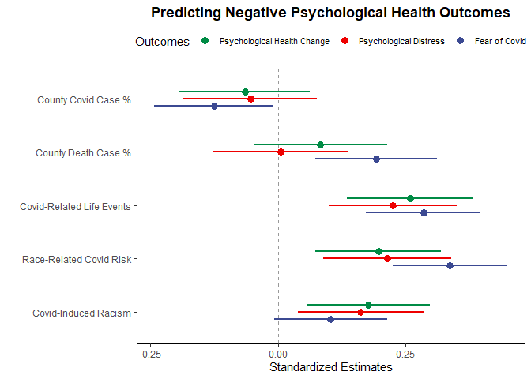
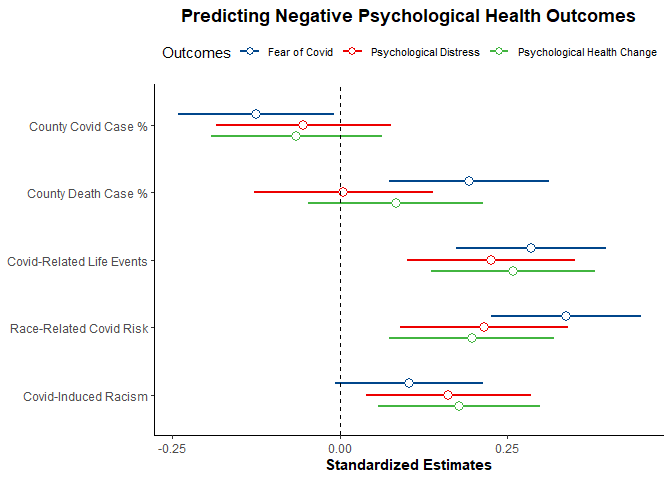

Portfolio 9 Dot-and-Whisker Plot
================
Colin Li
4/20/2023

People use multiple regression all the time. I always had a hard time
plotting regression results and did not know another way to report it
besides using tables. Then I discovered the Dot-and-Whisker Plot. The
plot below shows

``` r
library(psych)
```

    ## Warning: package 'psych' was built under R version 4.2.3

``` r
library(ggplot2)
```

    ## Warning: package 'ggplot2' was built under R version 4.2.3

    ## 
    ## Attaching package: 'ggplot2'

    ## The following objects are masked from 'package:psych':
    ## 
    ##     %+%, alpha

``` r
library(haven)
```

    ## Warning: package 'haven' was built under R version 4.2.3

``` r
library(data.table)
```

    ## Warning: package 'data.table' was built under R version 4.2.3

``` r
library(ggridges)
```

    ## Warning: package 'ggridges' was built under R version 4.2.3

``` r
library(ggsci)
```

    ## Warning: package 'ggsci' was built under R version 4.2.3

``` r
library(dotwhisker)
```

    ## Warning: package 'dotwhisker' was built under R version 4.2.3

``` r
library(dplyr)
```

    ## Warning: package 'dplyr' was built under R version 4.2.3

    ## 
    ## Attaching package: 'dplyr'

    ## The following objects are masked from 'package:data.table':
    ## 
    ##     between, first, last

    ## The following objects are masked from 'package:stats':
    ## 
    ##     filter, lag

    ## The following objects are masked from 'package:base':
    ## 
    ##     intersect, setdiff, setequal, union

``` r
library(magrittr)
library(lm.beta)
```

    ## Warning: package 'lm.beta' was built under R version 4.2.3

``` r
library(tibble)
```

    ## Warning: package 'tibble' was built under R version 4.2.3

``` r
library(jtools)
```

    ## Warning: package 'jtools' was built under R version 4.2.3

``` r
library(scales)
```

    ## 
    ## Attaching package: 'scales'

    ## The following objects are masked from 'package:psych':
    ## 
    ##     alpha, rescale

``` r
reg <- read_sav("C:/Users/Colin/Documents/reg.sav")

fear <- lm(fe ~ case_p + death_p + cv13 + risk_r + covrac, data = reg)

summary(fear)
```

    ## 
    ## Call:
    ## lm(formula = fe ~ case_p + death_p + cv13 + risk_r + covrac, 
    ##     data = reg)
    ## 
    ## Residuals:
    ##     Min      1Q  Median      3Q     Max 
    ## -2.0841 -0.7899 -0.1063  0.6567  2.4585 
    ## 
    ## Coefficients:
    ##             Estimate Std. Error t value Pr(>|t|)    
    ## (Intercept)  1.48008    0.27325   5.417 1.56e-07 ***
    ## case_p      -0.21567    0.10142  -2.126   0.0346 *  
    ## death_p      2.71570    0.85484   3.177   0.0017 ** 
    ## cv13         0.13929    0.02779   5.012 1.09e-06 ***
    ## risk_r       0.31327    0.05291   5.921 1.19e-08 ***
    ## covrac       0.07679    0.04158   1.847   0.0661 .  
    ## ---
    ## Signif. codes:  0 '***' 0.001 '**' 0.01 '*' 0.05 '.' 0.1 ' ' 1
    ## 
    ## Residual standard error: 1 on 225 degrees of freedom
    ##   (15 observations deleted due to missingness)
    ## Multiple R-squared:  0.3374, Adjusted R-squared:  0.3226 
    ## F-statistic: 22.91 on 5 and 225 DF,  p-value: < 2.2e-16

``` r
distress <- lm(dis ~ case_p + death_p + cv13 + risk_r + covrac , data = reg)

psyh <- lm(psyh ~ case_p + death_p + cv13 + risk_r + covrac, data = reg)
```

``` r
dwplot(fear) + theme_classic()
```

<!-- -->

``` r
dwplot(list(fear, distress, psyh), vline = geom_vline(
           xintercept = 0,
           colour = "grey60",
           linetype = 2
       ),
       vars_order = c("case_p", "death_p", "cv13", "risk_r", "covrac")) %>% 
  relabel_predictors(
        c(
            case_p = "County Covid Case %",
            death_p = "County Death Case %",
            cv13 = "Covid-Related Life Events",
            risk_r = "Race-Related Covid Risk",
           covrac = "Covid-Induced Racism"
        )) + theme_classic() + scale_color_aaas(name = "Outcome Variables",
        labels = c("Fear of Covid", "Psychological Distress", "Psychological Health Change")) + labs(title = "Predicting Negative Psychological Outcomes") + theme(plot.title = element_text(face = "bold", hjust = 0.5),  legend.position = c(0.5, 0.1),
        legend.justification = c(0, 0),
        legend.background = element_rect(colour = "grey80"),
        legend.title.align = .5
    )
```

<!-- -->

The dots are the estimates, the lines indicate 95% confidence intervals.
It might be easy to use covid-death percentages as an example. We can
see death% predicts fear of covid but not the other 2 outcomes because
the range includes 0. Obviously there are still problems. I wish the
lines and dots could be thicker. I also hope that I can plot the
standardized coefficients so the death% doesn’t look so dramatic.

``` r
reg <- reg[complete.cases(reg[ , c('case_p', 'death_p')]), ]


case_p.z <- (reg$case_p - mean(reg$case_p)) / sd(reg$case_p)

death_p.z <- (reg$death_p - mean(reg$death_p)) / sd(reg$death_p)

cv13.z <- (reg$cv13 - mean(reg$cv13)) / sd(reg$cv13)

risk_r.z <- (reg$risk_r - mean(reg$risk_r)) / sd(reg$risk_r)

covrac.z <- (reg$covrac - mean(reg$covrac)) / sd(reg$covrac)

fe.z <- (reg$fe - mean(reg$fe)) / sd(reg$fe)

dis.z <- (reg$dis - mean(reg$dis)) / sd(reg$dis)

psyh.z <- (reg$psyh - mean(reg$psyh)) / sd(reg$psyh)
```

``` r
fear.z <- lm(fe.z ~ case_p.z + death_p.z + cv13.z + risk_r.z + covrac.z, data = reg)

distress.z <- lm(dis.z ~ case_p.z + death_p.z + cv13.z + risk_r.z + covrac.z , data = reg)

psyh.z <- lm(psyh.z ~ case_p.z + death_p.z + cv13.z + risk_r.z + covrac.z, data = reg)

dwplot(list(fear.z, distress.z, psyh.z), vline = geom_vline(
           xintercept = 0,
           colour = "grey60",
           linetype = 2), whisker_args = list(width = 0.2, size = 1), dot_args = list(size = 3), 
       vars_order = c("case_p.z", "death_p.z", "cv13.z", "risk_r.z", "covrac.z")) %>% 
  relabel_predictors(
        c(
            case_p.z = "County Covid Case %",
            death_p.z = "County Death Case %",
            cv13.z = "Covid-Related Life Events",
            risk_r.z = "Race-Related Covid Risk",
           covrac.z = "Covid-Induced Racism"
        )) + theme_classic() + scale_color_aaas(name = "Outcomes",
        labels = c("Fear of Covid", "Psychological Distress", "Psychological Health Change")) + labs(title = "Predicting Negative Psychological Health Outcomes") + xlab("Standardized Estimates") + theme(plot.title = element_text(face = "bold", hjust = 0.5),  legend.position = "top", legend.text = element_text(size = 8) ) 
```

    ## Warning in geom_dw(df = df, point_args = point_args, segment_args = segment_args, : Ignoring unknown parameters: `width`
    ## Ignoring unknown parameters: `width`

<!-- -->

``` r
lancet <- c('#00468bff',    '#ED0000FF',    '#42B540FF',    '#0099B4FF',
'#925E9FFF',    '#FDAF91FF', '#AD002AFF',   '#ADB6B6FF',    
'#1B1919FF',    '#B09C85FF')


plot_summs(fear.z, distress.z, psyh.z, 
           model.names = c("Fear of Covid", "Psychological Distress", "Psychological Health Change"), coefs = c(
            "County Covid Case %" = "case_p.z",
            "County Death Case %" = "death_p.z" ,
            "Covid-Related Life Events" ="cv13.z" ,
            "Race-Related Covid Risk" ="risk_r.z" ,
           "Covid-Induced Racism" ="covrac.z" ), legend.title = "Outcomes", colors = lancet, point.shape=FALSE, point.size = 6) +labs(title = "Predicting Negative Psychological Health Outcomes") +  xlab("Standardized Estimates") + theme_classic() + theme(plot.title = element_text(face = "bold", hjust = 0.5), axis.title.y = element_blank(), axis.title.x = element_text(face = "bold"), legend.position = "top", legend.text = element_text(size = 8) )
```

    ## Registered S3 methods overwritten by 'broom':
    ##   method            from  
    ##   tidy.glht         jtools
    ##   tidy.summary.glht jtools

    ## Loading required namespace: broom.mixed
    ## Loading required namespace: broom.mixed
    ## Loading required namespace: broom.mixed

<!-- -->

I prefer the dotwhisker package to the jtools only because it provides
more customization. For example, here i cannot really change the whisker
size or dot shape. But given that both of these plotting functions are
based on ggplot2, so if I created the plots in ggplot2, it might provide
the optimal customization.
