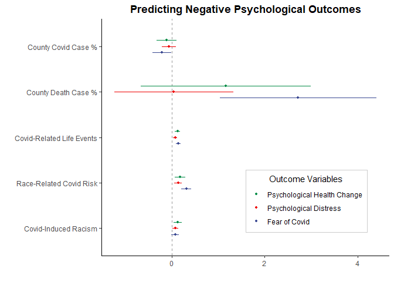

Portfolio 9 Dot-and-Whisker Plot
================
Colin Li
4/20/2023

People use multiple regression all the time. I always had a hard time
plotting regression results and did not know another way to report it
besides using tables. Then I discovered the Dot-and-Whisker Plot. The
plot below shows

``` r
library(psych)
```

    ## Warning: package 'psych' was built under R version 4.2.3

``` r
library(ggplot2)
```

    ## Warning: package 'ggplot2' was built under R version 4.2.3

    ## 
    ## Attaching package: 'ggplot2'

    ## The following objects are masked from 'package:psych':
    ## 
    ##     %+%, alpha

``` r
library(haven)
```

    ## Warning: package 'haven' was built under R version 4.2.3

``` r
library(data.table)
```

    ## Warning: package 'data.table' was built under R version 4.2.3

``` r
library(ggridges)
```

    ## Warning: package 'ggridges' was built under R version 4.2.3

``` r
library(ggsci)
```

    ## Warning: package 'ggsci' was built under R version 4.2.3

``` r
library(dotwhisker)
```

    ## Warning: package 'dotwhisker' was built under R version 4.2.3

``` r
library(dplyr)
```

    ## Warning: package 'dplyr' was built under R version 4.2.3

    ## 
    ## Attaching package: 'dplyr'

    ## The following objects are masked from 'package:data.table':
    ## 
    ##     between, first, last

    ## The following objects are masked from 'package:stats':
    ## 
    ##     filter, lag

    ## The following objects are masked from 'package:base':
    ## 
    ##     intersect, setdiff, setequal, union

``` r
library(magrittr)
library(lm.beta)
```

    ## Warning: package 'lm.beta' was built under R version 4.2.3

``` r
library(tibble)
```

    ## Warning: package 'tibble' was built under R version 4.2.3

``` r
reg <- read_sav("C:/Users/Colin/Documents/reg.sav")

fear <- lm(fe ~ case_p + death_p + cv13 + covrac, data = reg)

summary(fear)
```

    ## 
    ## Call:
    ## lm(formula = fe ~ case_p + death_p + cv13 + covrac, data = reg)
    ## 
    ## Residuals:
    ##     Min      1Q  Median      3Q     Max 
    ## -2.4883 -0.7809 -0.1151  0.7909  2.9227 
    ## 
    ## Coefficients:
    ##             Estimate Std. Error t value Pr(>|t|)    
    ## (Intercept)  1.82697    0.28630   6.381 9.82e-10 ***
    ## case_p      -0.23057    0.10876  -2.120  0.03510 *  
    ## death_p      2.81951    0.91679   3.075  0.00236 ** 
    ## cv13         0.17047    0.02927   5.823 1.97e-08 ***
    ## covrac       0.13063    0.04353   3.001  0.00299 ** 
    ## ---
    ## Signif. codes:  0 '***' 0.001 '**' 0.01 '*' 0.05 '.' 0.1 ' ' 1
    ## 
    ## Residual standard error: 1.073 on 226 degrees of freedom
    ##   (15 observations deleted due to missingness)
    ## Multiple R-squared:  0.2341, Adjusted R-squared:  0.2206 
    ## F-statistic: 17.27 on 4 and 226 DF,  p-value: 2.236e-12

``` r
sd<-lm.beta(fear)

distress <- lm(dis ~ case_p + death_p + cv13 + covrac, data = reg)

psyh <- lm(psyh ~ case_p + death_p + cv13 + covrac, data = reg)
```

``` r
dwplot(fear) + theme_classic()
```

<!-- -->

``` r
dwplot(list(fear, distress, psyh), vline = geom_vline(
           xintercept = 0,
           colour = "grey60",
           linetype = 2
       ),
       vars_order = c("case_p", "death_p", "cv13", "covrac")) %>% 
  relabel_predictors(
        c(
            case_p = "County Covid Case %",
            death_p = "County Death Case %",
            cv13 = "Covid-Related Life Events",
           covrac = "Covid-Induced Racism"
        )) + theme_classic() + scale_color_aaas(name = "Outcome Variables",
        labels = c("Fear of Covid", "Psychological Distress", "Psychological Health Change")) + labs(title = "Predicting Negative Psychological Outcomes") + theme(plot.title = element_text(face = "bold", hjust = 0.5),  legend.position = c(0.5, 0.1),
        legend.justification = c(0, 0),
        legend.background = element_rect(colour = "grey80"),
        legend.title.align = .5
    )
```

<!-- -->

The dots are the estimates, the lines indicate 95% confidence intervals.
It might be easy to use covid-death percentages as an example. We can
see death% predicts fear of covid but not the other 2 outcomes because
the range includes 0. Obviously there are still problems. I wish the
lines and dots could be thicker. I also hope that I can plot the
standardized coefficients so the death% doesn’t look so dramatic.
