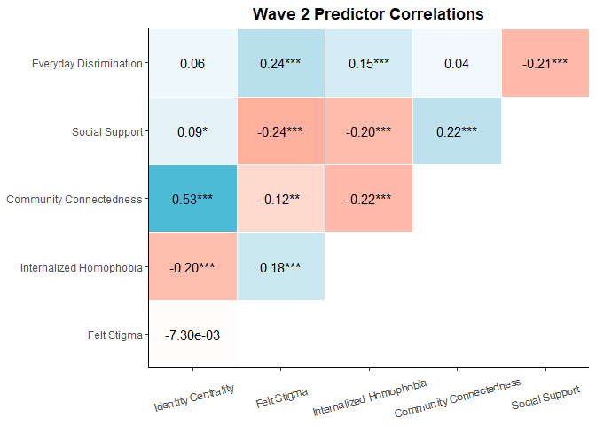

Portfolio 9 Dot-and-Whisker Plot
================
Colin Li
5/4/2023

My last portfolio. I thought I wanted to do something epic like
rayshader. But I don’t have the appropriate data. And I feel like even
if I made it, I won’t be able to use the code everyday because something
like that is not very common and it would end up being less useful. So I
decided to do logistic regression and path model for an upcoming project
I’m planning to submit to SPSP.

``` r
library(lme4)
```

    ## Warning: package 'lme4' was built under R version 4.2.3

    ## Loading required package: Matrix

    ## Warning: package 'Matrix' was built under R version 4.2.3

``` r
library(ggstatsplot)
```

    ## Warning: package 'ggstatsplot' was built under R version 4.2.3

    ## You can cite this package as:
    ##      Patil, I. (2021). Visualizations with statistical details: The 'ggstatsplot' approach.
    ##      Journal of Open Source Software, 6(61), 3167, doi:10.21105/joss.03167

``` r
library(correlation)
library(see)
```

    ## Warning: package 'see' was built under R version 4.2.3

``` r
library(tidygraph)
```

    ## Warning: package 'tidygraph' was built under R version 4.2.3

    ## 
    ## Attaching package: 'tidygraph'

    ## The following object is masked from 'package:stats':
    ## 
    ##     filter

``` r
library(ggplot2)
```

    ## Warning: package 'ggplot2' was built under R version 4.2.3

``` r
library(ggsci)
```

    ## Warning: package 'ggsci' was built under R version 4.2.3

    ## 
    ## Attaching package: 'ggsci'

    ## The following objects are masked from 'package:see':
    ## 
    ##     scale_color_material, scale_colour_material, scale_fill_material

``` r
load(file='C:/Users/Colin/Downloads/ICPSR_37166-V2 (1)/ICPSR_37166/DS0007/37166-0007-Data.rda')


W1<-correlation(da37166.0007[c("W1EVERYDAY", "W1SOCSUPPORT", "W1CONNECTEDNESS", "W1INTERNALIZED", "W1FELTSTIGMA", "W1IDCENTRAL")], use = "pairwise")

summary(W1)
```

    ## # Correlation Matrix (pearson-method)
    ## 
    ## Parameter       | W1IDCENTRAL | W1FELTSTIGMA | W1INTERNALIZED | W1CONNECTEDNESS | W1SOCSUPPORT
    ## ----------------------------------------------------------------------------------------------
    ## W1EVERYDAY      |        0.05 |      0.29*** |        0.16*** |            0.05 |     -0.19***
    ## W1SOCSUPPORT    |        0.03 |     -0.23*** |       -0.19*** |         0.16*** |             
    ## W1CONNECTEDNESS |     0.47*** |        -0.05 |       -0.20*** |                 |             
    ## W1INTERNALIZED  |    -0.14*** |      0.20*** |                |                 |             
    ## W1FELTSTIGMA    |   -3.00e-03 |              |                |                 |             
    ## 
    ## p-value adjustment method: Holm (1979)

``` r
W2<-correlation(da37166.0007[c("W2EVERYDAY", "W2SOCSUPPORT", "W2CONNECTEDNESS", "W2INTERNALIZED", "W2FELTSTIGMA", "W2IDCENTRAL")], use = "pairwise")

summary(W2)
```

    ## # Correlation Matrix (pearson-method)
    ## 
    ## Parameter       | W2IDCENTRAL | W2FELTSTIGMA | W2INTERNALIZED | W2CONNECTEDNESS | W2SOCSUPPORT
    ## ----------------------------------------------------------------------------------------------
    ## W2EVERYDAY      |        0.06 |      0.24*** |        0.15*** |            0.04 |     -0.21***
    ## W2SOCSUPPORT    |       0.09* |     -0.24*** |       -0.20*** |         0.22*** |             
    ## W2CONNECTEDNESS |     0.53*** |      -0.12** |       -0.22*** |                 |             
    ## W2INTERNALIZED  |    -0.20*** |      0.18*** |                |                 |             
    ## W2FELTSTIGMA    |   -7.30e-03 |              |                |                 |             
    ## 
    ## p-value adjustment method: Holm (1979)

``` r
W3<-correlation(da37166.0007[c("W3EVERYDAY", "W3SOCSUPPORT", "W3CONNECTEDNESS", "W3INTERNALIZED", "W3FELTSTIGMA", "W3IDCENTRAL")], use = "pairwise")

summary(W3)
```

    ## # Correlation Matrix (pearson-method)
    ## 
    ## Parameter       | W3IDCENTRAL | W3FELTSTIGMA | W3INTERNALIZED | W3CONNECTEDNESS | W3SOCSUPPORT
    ## ----------------------------------------------------------------------------------------------
    ## W3EVERYDAY      |        0.08 |      0.24*** |        0.15*** |            0.01 |     -0.20***
    ## W3SOCSUPPORT    |        0.08 |     -0.18*** |       -0.17*** |         0.19*** |             
    ## W3CONNECTEDNESS |     0.55*** |       -0.11* |       -0.25*** |                 |             
    ## W3INTERNALIZED  |    -0.18*** |      0.23*** |                |                 |             
    ## W3FELTSTIGMA    |   -2.85e-03 |              |                |                 |             
    ## 
    ## p-value adjustment method: Holm (1979)

``` r
plot(summary(correlation(data = da37166.0007[c("W1EVERYDAY", "W1SOCSUPPORT", "W1CONNECTEDNESS", "W1INTERNALIZED", "W1FELTSTIGMA", "W1IDCENTRAL")], rename = c("Everyday Disrimination", "Social Support", "Community Connectedness", "Internalized Homophobia", "Felt Stigma", "Identity Centrality")
))) + theme_classic() + theme(axis.text.x=element_text(vjust = 0.5, angle = 15), plot.title = element_text(face = "bold", hjust = 0.5)) + labs(title = "Wave 1 Predictor Correlations") + scale_fill_gradient2() 
```

    ## Scale for fill is already present.
    ## Adding another scale for fill, which will replace the existing scale.

<!-- -->

``` r
plot(summary(correlation(data = da37166.0007[c("W2EVERYDAY", "W2SOCSUPPORT", "W2CONNECTEDNESS", "W2INTERNALIZED", "W2FELTSTIGMA", "W2IDCENTRAL")], rename = c("Everyday Disrimination", "Social Support", "Community Connectedness", "Internalized Homophobia", "Felt Stigma", "Identity Centrality")
))) + theme_classic() + theme(axis.text.x=element_text(vjust = 0.5, angle = 15), plot.title = element_text(face = "bold", hjust = 0.5)) + labs(title = "Wave 2 Predictor Correlations") + scale_fill_gradient2() 
```

    ## Scale for fill is already present.
    ## Adding another scale for fill, which will replace the existing scale.

<!-- -->

``` r
plot(summary(correlation(data = da37166.0007[c("W3EVERYDAY", "W3SOCSUPPORT", "W3CONNECTEDNESS", "W3INTERNALIZED", "W3FELTSTIGMA", "W3IDCENTRAL")], rename = c("Everyday Disrimination", "Social Support", "Community Connectedness", "Internalized Homophobia", "Felt Stigma", "Identity Centrality")
))) + theme_classic() + theme(axis.text.x=element_text(vjust = 0.5, angle = 15), plot.title = element_text(face = "bold", hjust = 0.5)) + labs(title = "Wave 3 Predictor Correlations") + scale_fill_gradient2() 
```

    ## Scale for fill is already present.
    ## Adding another scale for fill, which will replace the existing scale.

<!-- -->

Based on the correlation results, perhaps I should take out community
engagement or identity centrality in the regression model

``` r
#logR<-glmer(W3Q29D ~ W2EVERYDAY + W3EVERYDAY + W2SOCSUPPORT + W3SOCSUPPORT + W2CONNECTEDNESS + W3CONNECTEDNESS + W2INTERNALIZED + W3INTERNALIZED + W2FELTSTIGMA + W3FELTSTIGMA + W2IDCENTRAL + W3IDCENTRAL + (1| STUDYID), data = da37166.0007, family = binomial()) #mixed effect model, not sure I would need it summary(logR)

logR_wave1<-glm(W2Q29D ~ W1EVERYDAY  + W1SOCSUPPORT  + W1CONNECTEDNESS  + W1INTERNALIZED  + W1FELTSTIGMA + W1IDCENTRAL, data =da37166.0007, family = binomial)

summary(logR_wave1)
```

    ## 
    ## Call:
    ## glm(formula = W2Q29D ~ W1EVERYDAY + W1SOCSUPPORT + W1CONNECTEDNESS + 
    ##     W1INTERNALIZED + W1FELTSTIGMA + W1IDCENTRAL, family = binomial, 
    ##     data = da37166.0007)
    ## 
    ## Deviance Residuals: 
    ##     Min       1Q   Median       3Q      Max  
    ## -1.9292  -1.3557   0.7726   0.8809   1.3756  
    ## 
    ## Coefficients:
    ##                 Estimate Std. Error z value Pr(>|z|)    
    ## (Intercept)      2.55380    0.65736   3.885 0.000102 ***
    ## W1EVERYDAY      -0.32954    0.12553  -2.625 0.008659 ** 
    ## W1SOCSUPPORT    -0.06712    0.06384  -1.051 0.293114    
    ## W1CONNECTEDNESS -0.27981    0.16340  -1.712 0.086823 .  
    ## W1INTERNALIZED  -0.11358    0.10955  -1.037 0.299822    
    ## W1FELTSTIGMA    -0.15748    0.08606  -1.830 0.067254 .  
    ## W1IDCENTRAL      0.15619    0.07656   2.040 0.041331 *  
    ## ---
    ## Signif. codes:  0 '***' 0.001 '**' 0.01 '*' 0.05 '.' 0.1 ' ' 1
    ## 
    ## (Dispersion parameter for binomial family taken to be 1)
    ## 
    ##     Null deviance: 998.38  on 801  degrees of freedom
    ## Residual deviance: 976.89  on 795  degrees of freedom
    ##   (716 observations deleted due to missingness)
    ## AIC: 990.89
    ## 
    ## Number of Fisher Scoring iterations: 4

``` r
logR_wave2<-glm(W3Q29D ~ W2EVERYDAY  + W2SOCSUPPORT  + W2CONNECTEDNESS  + W2INTERNALIZED  + W2FELTSTIGMA + W2IDCENTRAL, data =da37166.0007, family = binomial)

summary(logR_wave2)
```

    ## 
    ## Call:
    ## glm(formula = W3Q29D ~ W2EVERYDAY + W2SOCSUPPORT + W2CONNECTEDNESS + 
    ##     W2INTERNALIZED + W2FELTSTIGMA + W2IDCENTRAL, family = binomial, 
    ##     data = da37166.0007)
    ## 
    ## Deviance Residuals: 
    ##     Min       1Q   Median       3Q      Max  
    ## -1.9647  -1.2286   0.6947   0.8078   1.2237  
    ## 
    ## Coefficients:
    ##                 Estimate Std. Error z value Pr(>|z|)   
    ## (Intercept)      2.09099    0.82485   2.535  0.01125 * 
    ## W2EVERYDAY      -0.44251    0.15030  -2.944  0.00324 **
    ## W2SOCSUPPORT     0.10297    0.08303   1.240  0.21492   
    ## W2CONNECTEDNESS -0.16117    0.20591  -0.783  0.43379   
    ## W2INTERNALIZED  -0.11149    0.14281  -0.781  0.43498   
    ## W2FELTSTIGMA    -0.13140    0.10919  -1.203  0.22885   
    ## W2IDCENTRAL      0.03824    0.09532   0.401  0.68826   
    ## ---
    ## Signif. codes:  0 '***' 0.001 '**' 0.01 '*' 0.05 '.' 0.1 ' ' 1
    ## 
    ## (Dispersion parameter for binomial family taken to be 1)
    ## 
    ##     Null deviance: 652.71  on 562  degrees of freedom
    ## Residual deviance: 633.85  on 556  degrees of freedom
    ##   (955 observations deleted due to missingness)
    ## AIC: 647.85
    ## 
    ## Number of Fisher Scoring iterations: 4

``` r
logR_wave3<-glm(W3Q29D ~ W3EVERYDAY  + W3SOCSUPPORT  + W3CONNECTEDNESS  + W3INTERNALIZED  + W3FELTSTIGMA + W3IDCENTRAL, data =da37166.0007, family = binomial)

summary(logR_wave3)
```

    ## 
    ## Call:
    ## glm(formula = W3Q29D ~ W3EVERYDAY + W3SOCSUPPORT + W3CONNECTEDNESS + 
    ##     W3INTERNALIZED + W3FELTSTIGMA + W3IDCENTRAL, family = binomial, 
    ##     data = da37166.0007)
    ## 
    ## Deviance Residuals: 
    ##     Min       1Q   Median       3Q      Max  
    ## -1.9495  -1.3062   0.7007   0.8079   1.2245  
    ## 
    ## Coefficients:
    ##                   Estimate Std. Error z value Pr(>|z|)    
    ## (Intercept)      3.0511257  0.7710611   3.957 7.59e-05 ***
    ## W3EVERYDAY      -0.4008126  0.1428938  -2.805  0.00503 ** 
    ## W3SOCSUPPORT    -0.0114104  0.0794152  -0.144  0.88575    
    ## W3CONNECTEDNESS -0.2332123  0.1987450  -1.173  0.24063    
    ## W3INTERNALIZED  -0.2673091  0.1304837  -2.049  0.04050 *  
    ## W3FELTSTIGMA    -0.0919612  0.0975160  -0.943  0.34566    
    ## W3IDCENTRAL     -0.0004035  0.0945227  -0.004  0.99659    
    ## ---
    ## Signif. codes:  0 '***' 0.001 '**' 0.01 '*' 0.05 '.' 0.1 ' ' 1
    ## 
    ## (Dispersion parameter for binomial family taken to be 1)
    ## 
    ##     Null deviance: 749.58  on 640  degrees of freedom
    ## Residual deviance: 730.68  on 634  degrees of freedom
    ##   (877 observations deleted due to missingness)
    ## AIC: 744.68
    ## 
    ## Number of Fisher Scoring iterations: 4
