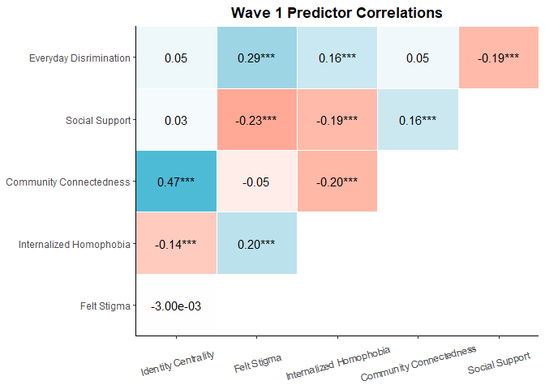
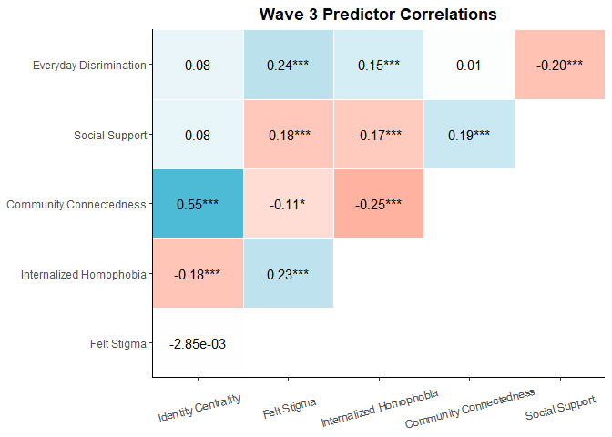
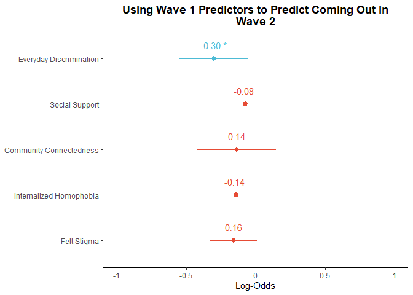
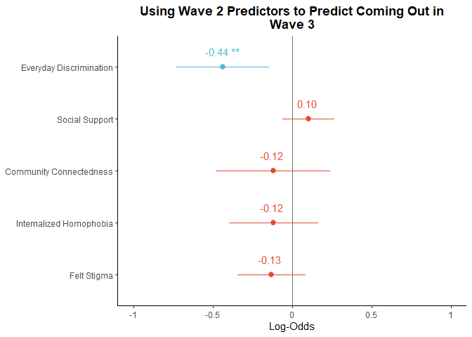
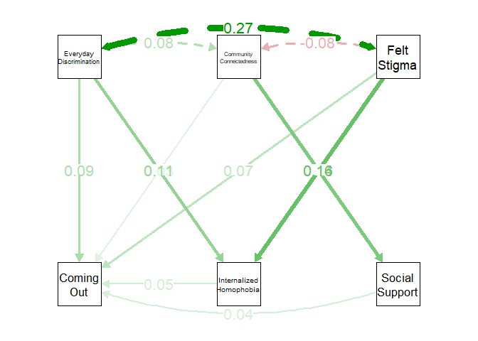
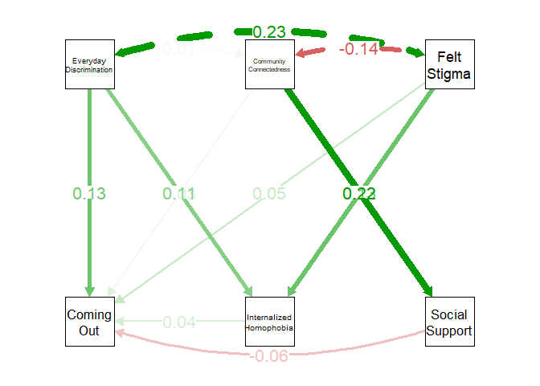
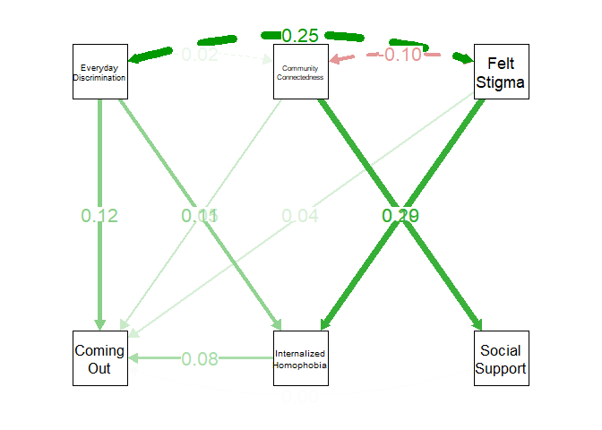

Portfolio 10 logistic regression and path model
================
Colin Li
5/4/2023

My last portfolio. I thought I wanted to do something epic like
rayshader. But I don’t have the appropriate data. And I feel like even
if I made it, I won’t be able to use the code everyday because something
like that is not very common and it would end up being less useful. So I
decided to do logistic regression and path model for an upcoming project
I’m planning to submit to SPSP.

``` r
library(lme4)
```

    ## Warning: package 'lme4' was built under R version 4.2.3

    ## Loading required package: Matrix

    ## Warning: package 'Matrix' was built under R version 4.2.3

``` r
library(ggstatsplot)
```

    ## Warning: package 'ggstatsplot' was built under R version 4.2.3

    ## You can cite this package as:
    ##      Patil, I. (2021). Visualizations with statistical details: The 'ggstatsplot' approach.
    ##      Journal of Open Source Software, 6(61), 3167, doi:10.21105/joss.03167

``` r
library(correlation)
library(see)
```

    ## Warning: package 'see' was built under R version 4.2.3

``` r
library(tidyverse)
```

    ## Warning: package 'tidyverse' was built under R version 4.2.3

    ## Warning: package 'ggplot2' was built under R version 4.2.3

    ## Warning: package 'tibble' was built under R version 4.2.3

    ## Warning: package 'tidyr' was built under R version 4.2.3

    ## Warning: package 'readr' was built under R version 4.2.3

    ## Warning: package 'purrr' was built under R version 4.2.3

    ## Warning: package 'dplyr' was built under R version 4.2.3

    ## Warning: package 'forcats' was built under R version 4.2.3

    ## Warning: package 'lubridate' was built under R version 4.2.3

    ## ── Attaching core tidyverse packages ──────────────────────── tidyverse 2.0.0 ──
    ## ✔ dplyr     1.1.1     ✔ readr     2.1.4
    ## ✔ forcats   1.0.0     ✔ stringr   1.5.0
    ## ✔ ggplot2   3.4.1     ✔ tibble    3.2.1
    ## ✔ lubridate 1.9.2     ✔ tidyr     1.3.0
    ## ✔ purrr     1.0.1

    ## ── Conflicts ────────────────────────────────────────── tidyverse_conflicts() ──
    ## ✖ tidyr::expand() masks Matrix::expand()
    ## ✖ dplyr::filter() masks stats::filter()
    ## ✖ dplyr::lag()    masks stats::lag()
    ## ✖ tidyr::pack()   masks Matrix::pack()
    ## ✖ tidyr::unpack() masks Matrix::unpack()
    ## ℹ Use the conflicted package (<http://conflicted.r-lib.org/>) to force all conflicts to become errors

``` r
library(tidygraph)
```

    ## Warning: package 'tidygraph' was built under R version 4.2.3

    ## 
    ## Attaching package: 'tidygraph'
    ## 
    ## The following object is masked from 'package:stats':
    ## 
    ##     filter

``` r
library(ggplot2)
library(ggsci)
```

    ## Warning: package 'ggsci' was built under R version 4.2.3

    ## 
    ## Attaching package: 'ggsci'
    ## 
    ## The following objects are masked from 'package:see':
    ## 
    ##     scale_color_material, scale_colour_material, scale_fill_material

``` r
library(GGally)
```

    ## Warning: package 'GGally' was built under R version 4.2.3

    ## Registered S3 method overwritten by 'GGally':
    ##   method from   
    ##   +.gg   ggplot2

``` r
library(sjPlot)
```

    ## Warning: package 'sjPlot' was built under R version 4.2.3

``` r
library(lavaan)
```

    ## Warning: package 'lavaan' was built under R version 4.2.3

    ## This is lavaan 0.6-15
    ## lavaan is FREE software! Please report any bugs.

``` r
library(semPlot)
library(psych)
```

    ## Warning: package 'psych' was built under R version 4.2.3

    ## 
    ## Attaching package: 'psych'
    ## 
    ## The following object is masked from 'package:lavaan':
    ## 
    ##     cor2cov
    ## 
    ## The following objects are masked from 'package:ggplot2':
    ## 
    ##     %+%, alpha

``` r
load(file='C:/Users/Colin/Downloads/ICPSR_37166-V2 (1)/ICPSR_37166/DS0007/37166-0007-Data.rda')


W1<-correlation(da37166.0007[c("W1EVERYDAY", "W1SOCSUPPORT", "W1CONNECTEDNESS", "W1INTERNALIZED", "W1FELTSTIGMA", "W1IDCENTRAL")], use = "pairwise")

summary(W1)
```

    ## # Correlation Matrix (pearson-method)
    ## 
    ## Parameter       | W1IDCENTRAL | W1FELTSTIGMA | W1INTERNALIZED | W1CONNECTEDNESS | W1SOCSUPPORT
    ## ----------------------------------------------------------------------------------------------
    ## W1EVERYDAY      |        0.05 |      0.29*** |        0.16*** |            0.05 |     -0.19***
    ## W1SOCSUPPORT    |        0.03 |     -0.23*** |       -0.19*** |         0.16*** |             
    ## W1CONNECTEDNESS |     0.47*** |        -0.05 |       -0.20*** |                 |             
    ## W1INTERNALIZED  |    -0.14*** |      0.20*** |                |                 |             
    ## W1FELTSTIGMA    |   -3.00e-03 |              |                |                 |             
    ## 
    ## p-value adjustment method: Holm (1979)

``` r
W2<-correlation(da37166.0007[c("W2EVERYDAY", "W2SOCSUPPORT", "W2CONNECTEDNESS", "W2INTERNALIZED", "W2FELTSTIGMA", "W2IDCENTRAL")], use = "pairwise")

summary(W2)
```

    ## # Correlation Matrix (pearson-method)
    ## 
    ## Parameter       | W2IDCENTRAL | W2FELTSTIGMA | W2INTERNALIZED | W2CONNECTEDNESS | W2SOCSUPPORT
    ## ----------------------------------------------------------------------------------------------
    ## W2EVERYDAY      |        0.06 |      0.24*** |        0.15*** |            0.04 |     -0.21***
    ## W2SOCSUPPORT    |       0.09* |     -0.24*** |       -0.20*** |         0.22*** |             
    ## W2CONNECTEDNESS |     0.53*** |      -0.12** |       -0.22*** |                 |             
    ## W2INTERNALIZED  |    -0.20*** |      0.18*** |                |                 |             
    ## W2FELTSTIGMA    |   -7.30e-03 |              |                |                 |             
    ## 
    ## p-value adjustment method: Holm (1979)

``` r
W3<-correlation(da37166.0007[c("W3EVERYDAY", "W3SOCSUPPORT", "W3CONNECTEDNESS", "W3INTERNALIZED", "W3FELTSTIGMA", "W3IDCENTRAL")], use = "pairwise")

summary(W3)
```

    ## # Correlation Matrix (pearson-method)
    ## 
    ## Parameter       | W3IDCENTRAL | W3FELTSTIGMA | W3INTERNALIZED | W3CONNECTEDNESS | W3SOCSUPPORT
    ## ----------------------------------------------------------------------------------------------
    ## W3EVERYDAY      |        0.08 |      0.24*** |        0.15*** |            0.01 |     -0.20***
    ## W3SOCSUPPORT    |        0.08 |     -0.18*** |       -0.17*** |         0.19*** |             
    ## W3CONNECTEDNESS |     0.55*** |       -0.11* |       -0.25*** |                 |             
    ## W3INTERNALIZED  |    -0.18*** |      0.23*** |                |                 |             
    ## W3FELTSTIGMA    |   -2.85e-03 |              |                |                 |             
    ## 
    ## p-value adjustment method: Holm (1979)

``` r
plot(summary(correlation(data = da37166.0007[c("W1EVERYDAY", "W1SOCSUPPORT", "W1CONNECTEDNESS", "W1INTERNALIZED", "W1FELTSTIGMA", "W1IDCENTRAL")], rename = c("Everyday Disrimination", "Social Support", "Community Connectedness", "Internalized Homophobia", "Felt Stigma", "Identity Centrality")
))) + theme_classic() + theme(axis.text.x=element_text(vjust = 0.5, angle = 15), plot.title = element_text(face = "bold", hjust = 0.5)) + labs(title = "Wave 1 Predictor Correlations") + scale_fill_gradient2(low = "#E64B35FF",
  mid = "white",
  high = "#4DBBD5FF") + guides(fill = FALSE)
```

    ## Scale for fill is already present.
    ## Adding another scale for fill, which will replace the existing scale.

    ## Warning: The `<scale>` argument of `guides()` cannot be `FALSE`. Use "none" instead as
    ## of ggplot2 3.3.4.
    ## This warning is displayed once every 8 hours.
    ## Call `lifecycle::last_lifecycle_warnings()` to see where this warning was
    ## generated.

<!-- -->

``` r
plot(summary(correlation(data = da37166.0007[c("W2EVERYDAY", "W2SOCSUPPORT", "W2CONNECTEDNESS", "W2INTERNALIZED", "W2FELTSTIGMA", "W2IDCENTRAL")], rename = c("Everyday Disrimination", "Social Support", "Community Connectedness", "Internalized Homophobia", "Felt Stigma", "Identity Centrality")
))) + theme_classic() + theme(axis.text.x=element_text(vjust = 0.5, angle = 15), plot.title = element_text(face = "bold", hjust = 0.5)) + labs(title = "Wave 2 Predictor Correlations") + scale_fill_gradient2(low = "#E64B35FF",
  mid = "white",
  high = "#4DBBD5FF") + guides(fill = FALSE)
```

    ## Scale for fill is already present.
    ## Adding another scale for fill, which will replace the existing scale.

<!-- -->

``` r
plot(summary(correlation(data = da37166.0007[c("W3EVERYDAY", "W3SOCSUPPORT", "W3CONNECTEDNESS", "W3INTERNALIZED", "W3FELTSTIGMA", "W3IDCENTRAL")], rename = c("Everyday Disrimination", "Social Support", "Community Connectedness", "Internalized Homophobia", "Felt Stigma", "Identity Centrality")
))) + theme_classic() + theme(axis.text.x=element_text(vjust = 0.5, angle = 15), plot.title = element_text(face = "bold", hjust = 0.5)) + labs(title = "Wave 3 Predictor Correlations") + scale_fill_gradient2(low = "#E64B35FF",
  mid = "white",
  high = "#4DBBD5FF") + guides(fill = FALSE)
```

    ## Scale for fill is already present.
    ## Adding another scale for fill, which will replace the existing scale.

<!-- -->

Based on the correlation results, perhaps I should take out community
engagement or identity centrality in the regression model

``` r
#logR<-glmer(W3Q29D ~ W2EVERYDAY + W3EVERYDAY + W2SOCSUPPORT + W3SOCSUPPORT + W2CONNECTEDNESS + W3CONNECTEDNESS + W2INTERNALIZED + W3INTERNALIZED + W2FELTSTIGMA + W3FELTSTIGMA + W2IDCENTRAL + W3IDCENTRAL + (1| STUDYID), data = da37166.0007, family = binomial()) #mixed effect model, not sure I would need it summary(logR)

glm(W2Q29D ~ W1IDCENTRAL, data =da37166.0007, family = binomial)
```

    ## 
    ## Call:  glm(formula = W2Q29D ~ W1IDCENTRAL, family = binomial, data = da37166.0007)
    ## 
    ## Coefficients:
    ## (Intercept)  W1IDCENTRAL  
    ##     0.39548      0.09789  
    ## 
    ## Degrees of Freedom: 867 Total (i.e. Null);  866 Residual
    ##   (650 observations deleted due to missingness)
    ## Null Deviance:       1081 
    ## Residual Deviance: 1079  AIC: 1083

``` r
logR_wave1<-glm(W2Q29D ~ W1EVERYDAY  + W1SOCSUPPORT  + W1CONNECTEDNESS  + W1INTERNALIZED  + W1FELTSTIGMA, data =da37166.0007, family = binomial)

summary(logR_wave1)
```

    ## 
    ## Call:
    ## glm(formula = W2Q29D ~ W1EVERYDAY + W1SOCSUPPORT + W1CONNECTEDNESS + 
    ##     W1INTERNALIZED + W1FELTSTIGMA, family = binomial, data = da37166.0007)
    ## 
    ## Deviance Residuals: 
    ##     Min       1Q   Median       3Q      Max  
    ## -1.8736  -1.3791   0.7815   0.8743   1.3098  
    ## 
    ## Coefficients:
    ##                 Estimate Std. Error z value Pr(>|z|)    
    ## (Intercept)      2.78742    0.64865   4.297 1.73e-05 ***
    ## W1EVERYDAY      -0.30218    0.12438  -2.429   0.0151 *  
    ## W1SOCSUPPORT    -0.07573    0.06349  -1.193   0.2329    
    ## W1CONNECTEDNESS -0.13612    0.14517  -0.938   0.3484    
    ## W1INTERNALIZED  -0.13904    0.10881  -1.278   0.2013    
    ## W1FELTSTIGMA    -0.15957    0.08597  -1.856   0.0634 .  
    ## ---
    ## Signif. codes:  0 '***' 0.001 '**' 0.01 '*' 0.05 '.' 0.1 ' ' 1
    ## 
    ## (Dispersion parameter for binomial family taken to be 1)
    ## 
    ##     Null deviance: 999.89  on 803  degrees of freedom
    ## Residual deviance: 982.76  on 798  degrees of freedom
    ##   (714 observations deleted due to missingness)
    ## AIC: 994.76
    ## 
    ## Number of Fisher Scoring iterations: 4

``` r
logR_wave2<-glm(W3Q29D ~ W2EVERYDAY  + W2SOCSUPPORT  + W2CONNECTEDNESS  + W2INTERNALIZED  + W2FELTSTIGMA, data =da37166.0007, family = binomial)

glm(W3Q29D ~ W2EVERYDAY  + W2SOCSUPPORT  + W2CONNECTEDNESS  + W2INTERNALIZED  + W2FELTSTIGMA, data =da37166.0007, family = binomial)
```

    ## 
    ## Call:  glm(formula = W3Q29D ~ W2EVERYDAY + W2SOCSUPPORT + W2CONNECTEDNESS + 
    ##     W2INTERNALIZED + W2FELTSTIGMA, family = binomial, data = da37166.0007)
    ## 
    ## Coefficients:
    ##     (Intercept)       W2EVERYDAY     W2SOCSUPPORT  W2CONNECTEDNESS  
    ##          2.1174          -0.4376           0.1038          -0.1181  
    ##  W2INTERNALIZED     W2FELTSTIGMA  
    ##         -0.1199          -0.1304  
    ## 
    ## Degrees of Freedom: 564 Total (i.e. Null);  559 Residual
    ##   (953 observations deleted due to missingness)
    ## Null Deviance:       654 
    ## Residual Deviance: 635.3     AIC: 647.3

``` r
summary(logR_wave2)
```

    ## 
    ## Call:
    ## glm(formula = W3Q29D ~ W2EVERYDAY + W2SOCSUPPORT + W2CONNECTEDNESS + 
    ##     W2INTERNALIZED + W2FELTSTIGMA, family = binomial, data = da37166.0007)
    ## 
    ## Deviance Residuals: 
    ##     Min       1Q   Median       3Q      Max  
    ## -1.9696  -1.2228   0.6892   0.8028   1.2182  
    ## 
    ## Coefficients:
    ##                 Estimate Std. Error z value Pr(>|z|)   
    ## (Intercept)      2.11739    0.81915   2.585  0.00974 **
    ## W2EVERYDAY      -0.43756    0.15024  -2.912  0.00359 **
    ## W2SOCSUPPORT     0.10380    0.08314   1.249  0.21184   
    ## W2CONNECTEDNESS -0.11808    0.18341  -0.644  0.51968   
    ## W2INTERNALIZED  -0.11992    0.14209  -0.844  0.39868   
    ## W2FELTSTIGMA    -0.13043    0.10910  -1.196  0.23185   
    ## ---
    ## Signif. codes:  0 '***' 0.001 '**' 0.01 '*' 0.05 '.' 0.1 ' ' 1
    ## 
    ## (Dispersion parameter for binomial family taken to be 1)
    ## 
    ##     Null deviance: 653.95  on 564  degrees of freedom
    ## Residual deviance: 635.27  on 559  degrees of freedom
    ##   (953 observations deleted due to missingness)
    ## AIC: 647.27
    ## 
    ## Number of Fisher Scoring iterations: 4

``` r
logR_wave3<-glm(W3Q29D ~ W3EVERYDAY  + W3SOCSUPPORT  + W3CONNECTEDNESS  + W3INTERNALIZED  + W3FELTSTIGMA, data =da37166.0007, family = binomial)

summary(logR_wave3)
```

    ## 
    ## Call:
    ## glm(formula = W3Q29D ~ W3EVERYDAY + W3SOCSUPPORT + W3CONNECTEDNESS + 
    ##     W3INTERNALIZED + W3FELTSTIGMA, family = binomial, data = da37166.0007)
    ## 
    ## Deviance Residuals: 
    ##     Min       1Q   Median       3Q      Max  
    ## -1.9508  -1.3034   0.6971   0.8059   1.2119  
    ## 
    ## Coefficients:
    ##                 Estimate Std. Error z value Pr(>|z|)    
    ## (Intercept)      3.02465    0.76674   3.945 7.99e-05 ***
    ## W3EVERYDAY      -0.40065    0.14276  -2.806  0.00501 ** 
    ## W3SOCSUPPORT    -0.00951    0.07930  -0.120  0.90454    
    ## W3CONNECTEDNESS -0.22417    0.16914  -1.325  0.18505    
    ## W3INTERNALIZED  -0.26150    0.12976  -2.015  0.04388 *  
    ## W3FELTSTIGMA    -0.09566    0.09724  -0.984  0.32524    
    ## ---
    ## Signif. codes:  0 '***' 0.001 '**' 0.01 '*' 0.05 '.' 0.1 ' ' 1
    ## 
    ## (Dispersion parameter for binomial family taken to be 1)
    ## 
    ##     Null deviance: 752.73  on 645  degrees of freedom
    ## Residual deviance: 733.99  on 640  degrees of freedom
    ##   (872 observations deleted due to missingness)
    ## AIC: 745.99
    ## 
    ## Number of Fisher Scoring iterations: 4

``` r
#Not sure if using wave 3 data to predict wave 3 outcome is legit

plot_model(logR_wave1, group.terms = c(1, 2, 2, 2, 2), colors=c("#4DBBD5FF","#E64B35FF"), show.values = TRUE, value.offset = .3, vline.color = "#1B191999", title = "Using Wave 1 Predictors to Predict Coming Out in Wave 2", type ="est", transform = NULL) + theme_classic() + theme(plot.title = element_text(face = "bold", hjust = 0.5)) + scale_x_discrete(labels=c("Felt Stigma", "Internalized Homophobia", "Community Connectedness","Social Support", "Everyday Discrimination"))
```

    ## Scale for x is already present.
    ## Adding another scale for x, which will replace the existing scale.

<!-- -->

``` r
plot_model(logR_wave2, group.terms = c(1, 2, 2, 2, 2), colors=c("#4DBBD5FF","#E64B35FF"), show.values = TRUE, value.offset = .3, vline.color = "#1B191999", title = "Using Wave 2 Predictors to Predict Coming Out in Wave 3", type ="est", transform = NULL) + theme_classic() + theme(plot.title = element_text(face = "bold", hjust = 0.5)) + scale_x_discrete(labels=c("Felt Stigma", "Internalized Homophobia", "Community Connectedness","Social Support", "Everyday Discrimination"))
```

    ## Scale for x is already present.
    ## Adding another scale for x, which will replace the existing scale.

<!-- -->

``` r
plot_model(logR_wave3, group.terms = c(1, 2, 2, 1, 2), colors=c("#4DBBD5FF","#E64B35FF"), show.values = TRUE, value.offset = .3, vline.color = "#1B191999", title = "Using Wave 3 Predictors to Predict Coming Out in Wave 3", type ="est", transform = NULL) + theme_classic() + theme(plot.title = element_text(face = "bold", hjust = 0.5)) + scale_x_discrete(labels=c("Felt Stigma", "Internalized Homophobia", "Community Connectedness","Social Support", "Everyday Discrimination"))
```

    ## Scale for x is already present.
    ## Adding another scale for x, which will replace the existing scale.

<!-- --> I changed all
the x axis to log-odds. But by default it plots odds ratio, which I
don’t quite understand the benefit of it. Because the outcome was coded
as (1)yes, (2)no. Greater scores of everyday discrimination means less
encounters with discrimination. So the negative prediction of everyday
discrimination means more daily discrimination, less likely to come out
or less discrimination, more likely to come out.

``` r
path1 <-'W2Q29D ~ W1EVERYDAY  + W1SOCSUPPORT  + W1CONNECTEDNESS  + W1INTERNALIZED  + W1FELTSTIGMA

W1INTERNALIZED ~ W1FELTSTIGMA + W1EVERYDAY

W1SOCSUPPORT ~ W1CONNECTEDNESS

'

da37166.0007$W2Q29D<-as.numeric(da37166.0007$W2Q29D=="(1) Yes")


fit1<-sem(path1, data = da37166.0007)

summary(fit1, fit.measures=TRUE, standardized=T)
```

    ## lavaan 0.6.15 ended normally after 1 iteration
    ## 
    ##   Estimator                                         ML
    ##   Optimization method                           NLMINB
    ##   Number of model parameters                        11
    ## 
    ##                                                   Used       Total
    ##   Number of observations                           804        1518
    ## 
    ## Model Test User Model:
    ##                                                       
    ##   Test statistic                                66.478
    ##   Degrees of freedom                                 4
    ##   P-value (Chi-square)                           0.000
    ## 
    ## Model Test Baseline Model:
    ## 
    ##   Test statistic                               139.610
    ##   Degrees of freedom                                12
    ##   P-value                                        0.000
    ## 
    ## User Model versus Baseline Model:
    ## 
    ##   Comparative Fit Index (CFI)                    0.510
    ##   Tucker-Lewis Index (TLI)                      -0.469
    ## 
    ## Loglikelihood and Information Criteria:
    ## 
    ##   Loglikelihood user model (H0)              -2707.846
    ##   Loglikelihood unrestricted model (H1)      -2674.607
    ##                                                       
    ##   Akaike (AIC)                                5437.693
    ##   Bayesian (BIC)                              5489.278
    ##   Sample-size adjusted Bayesian (SABIC)       5454.347
    ## 
    ## Root Mean Square Error of Approximation:
    ## 
    ##   RMSEA                                          0.139
    ##   90 Percent confidence interval - lower         0.111
    ##   90 Percent confidence interval - upper         0.170
    ##   P-value H_0: RMSEA <= 0.050                    0.000
    ##   P-value H_0: RMSEA >= 0.080                    1.000
    ## 
    ## Standardized Root Mean Square Residual:
    ## 
    ##   SRMR                                           0.072
    ## 
    ## Parameter Estimates:
    ## 
    ##   Standard errors                             Standard
    ##   Information                                 Expected
    ##   Information saturated (h1) model          Structured
    ## 
    ## Regressions:
    ##                    Estimate  Std.Err  z-value  P(>|z|)   Std.lv  Std.all
    ##   W2Q29D ~                                                              
    ##     W1EVERYDAY        0.066    0.026    2.486    0.013    0.066    0.091
    ##     W1SOCSUPPORT      0.016    0.013    1.233    0.218    0.016    0.043
    ##     W1CONNECTEDNES    0.029    0.030    0.969    0.333    0.029    0.034
    ##     W1INTERNALIZED    0.030    0.023    1.300    0.193    0.030    0.046
    ##     W1FELTSTIGMA      0.034    0.018    1.885    0.059    0.034    0.069
    ##   W1INTERNALIZED ~                                                      
    ##     W1FELTSTIGMA      0.121    0.027    4.496    0.000    0.121    0.161
    ##     W1EVERYDAY        0.127    0.040    3.188    0.001    0.127    0.114
    ##   W1SOCSUPPORT ~                                                        
    ##     W1CONNECTEDNES    0.329    0.083    3.976    0.000    0.329    0.139
    ## 
    ## Variances:
    ##                    Estimate  Std.Err  z-value  P(>|z|)   Std.lv  Std.all
    ##    .W2Q29D            0.211    0.011   20.050    0.000    0.211    0.975
    ##    .W1INTERNALIZED    0.491    0.024   20.050    0.000    0.491    0.951
    ##    .W1SOCSUPPORT      1.635    0.082   20.050    0.000    1.635    0.981

``` r
semPaths(fit1, "std", layout = "tree", edge.width = 1.5, edge.label.cex = 1.5, node.width=2, residuals=FALSE, nodeLabels = c("Coming Out", "Internalized Homophobia", "Social Support", "Everyday Discrimination", "Community Connectedness", "Felt Stigma"), label.cex =1.2)
```

<!-- -->

``` r
path2 <-'W3Q29D ~ W2EVERYDAY  + W2SOCSUPPORT  + W2CONNECTEDNESS  + W2INTERNALIZED  + W2FELTSTIGMA

W2INTERNALIZED ~ W2FELTSTIGMA + W2EVERYDAY

W2SOCSUPPORT ~ W2CONNECTEDNESS

'

da37166.0007$W3Q29D<-as.numeric(da37166.0007$W3Q29D=="(1) Yes")

describe(da37166.0007$W3Q29D)
```

    ##    vars   n mean   sd median trimmed mad min max range skew kurtosis   se
    ## X1    1 692 0.27 0.44      0    0.21   0   0   1     1 1.05     -0.9 0.02

``` r
fit2<-sem(path2, data = da37166.0007)

summary(fit2, fit.measures=TRUE, standardized=T)
```

    ## lavaan 0.6.15 ended normally after 1 iteration
    ## 
    ##   Estimator                                         ML
    ##   Optimization method                           NLMINB
    ##   Number of model parameters                        11
    ## 
    ##                                                   Used       Total
    ##   Number of observations                           565        1518
    ## 
    ## Model Test User Model:
    ##                                                       
    ##   Test statistic                                78.691
    ##   Degrees of freedom                                 4
    ##   P-value (Chi-square)                           0.000
    ## 
    ## Model Test Baseline Model:
    ## 
    ##   Test statistic                               148.034
    ##   Degrees of freedom                                12
    ##   P-value                                        0.000
    ## 
    ## User Model versus Baseline Model:
    ## 
    ##   Comparative Fit Index (CFI)                    0.451
    ##   Tucker-Lewis Index (TLI)                      -0.647
    ## 
    ## Loglikelihood and Information Criteria:
    ## 
    ##   Loglikelihood user model (H0)              -1815.050
    ##   Loglikelihood unrestricted model (H1)      -1775.705
    ##                                                       
    ##   Akaike (AIC)                                3652.100
    ##   Bayesian (BIC)                              3699.806
    ##   Sample-size adjusted Bayesian (SABIC)       3664.886
    ## 
    ## Root Mean Square Error of Approximation:
    ## 
    ##   RMSEA                                          0.182
    ##   90 Percent confidence interval - lower         0.148
    ##   90 Percent confidence interval - upper         0.218
    ##   P-value H_0: RMSEA <= 0.050                    0.000
    ##   P-value H_0: RMSEA >= 0.080                    1.000
    ## 
    ## Standardized Root Mean Square Residual:
    ## 
    ##   SRMR                                           0.090
    ## 
    ## Parameter Estimates:
    ## 
    ##   Standard errors                             Standard
    ##   Information                                 Expected
    ##   Information saturated (h1) model          Structured
    ## 
    ## Regressions:
    ##                    Estimate  Std.Err  z-value  P(>|z|)   Std.lv  Std.all
    ##   W3Q29D ~                                                              
    ##     W2EVERYDAY        0.089    0.029    3.055    0.002    0.089    0.131
    ##     W2SOCSUPPORT     -0.020    0.015   -1.308    0.191   -0.020   -0.056
    ##     W2CONNECTEDNES    0.023    0.034    0.664    0.507    0.023    0.029
    ##     W2INTERNALIZED    0.024    0.027    0.885    0.376    0.024    0.037
    ##     W2FELTSTIGMA      0.024    0.021    1.184    0.236    0.024    0.051
    ##   W2INTERNALIZED ~                                                      
    ##     W2FELTSTIGMA      0.099    0.032    3.154    0.002    0.099    0.134
    ##     W2EVERYDAY        0.115    0.045    2.541    0.011    0.115    0.108
    ##   W2SOCSUPPORT ~                                                        
    ##     W2CONNECTEDNES    0.494    0.090    5.472    0.000    0.494    0.224
    ## 
    ## Variances:
    ##                    Estimate  Std.Err  z-value  P(>|z|)   Std.lv  Std.all
    ##    .W3Q29D            0.188    0.011   16.808    0.000    0.188    0.971
    ##    .W2INTERNALIZED    0.461    0.027   16.808    0.000    0.461    0.964
    ##    .W2SOCSUPPORT      1.424    0.085   16.808    0.000    1.424    0.950

``` r
semPaths(fit2, "std", layout = "tree", edge.width = 1.5, edge.label.cex = 1.5, node.width=2, residuals=FALSE, nodeLabels = c("Coming Out", "Internalized Homophobia", "Social Support", "Everyday Discrimination", "Community Connectedness", "Felt Stigma"), label.cex =1.2)
```

<!-- -->

This is my first time building a path model. Obviously the model fit is
pretty bad… And the diagram created by the semplot does not look pretty
:(, the numbers overlapped. I guess this just isn’t the best package to
visualize path analysis results.

``` r
path3 <-'W3Q29D ~ W3EVERYDAY  + W3SOCSUPPORT  + W3CONNECTEDNESS  + W3INTERNALIZED  + W3FELTSTIGMA

W3INTERNALIZED ~ W3FELTSTIGMA + W3EVERYDAY

W3SOCSUPPORT ~ W3CONNECTEDNESS

'


describe(da37166.0007$W3Q29D)
```

    ##    vars   n mean   sd median trimmed mad min max range skew kurtosis   se
    ## X1    1 692 0.27 0.44      0    0.21   0   0   1     1 1.05     -0.9 0.02

``` r
fit3<-sem(path3, data = da37166.0007)

summary(fit3, fit.measures=TRUE, standardized=T)
```

    ## lavaan 0.6.15 ended normally after 1 iteration
    ## 
    ##   Estimator                                         ML
    ##   Optimization method                           NLMINB
    ##   Number of model parameters                        11
    ## 
    ##                                                   Used       Total
    ##   Number of observations                           646        1518
    ## 
    ## Model Test User Model:
    ##                                                       
    ##   Test statistic                                80.150
    ##   Degrees of freedom                                 4
    ##   P-value (Chi-square)                           0.000
    ## 
    ## Model Test Baseline Model:
    ## 
    ##   Test statistic                               164.782
    ##   Degrees of freedom                                12
    ##   P-value                                        0.000
    ## 
    ## User Model versus Baseline Model:
    ## 
    ##   Comparative Fit Index (CFI)                    0.502
    ##   Tucker-Lewis Index (TLI)                      -0.495
    ## 
    ## Loglikelihood and Information Criteria:
    ## 
    ##   Loglikelihood user model (H0)              -2074.035
    ##   Loglikelihood unrestricted model (H1)      -2033.959
    ##                                                       
    ##   Akaike (AIC)                                4170.069
    ##   Bayesian (BIC)                              4219.248
    ##   Sample-size adjusted Bayesian (SABIC)       4184.324
    ## 
    ## Root Mean Square Error of Approximation:
    ## 
    ##   RMSEA                                          0.172
    ##   90 Percent confidence interval - lower         0.140
    ##   90 Percent confidence interval - upper         0.205
    ##   P-value H_0: RMSEA <= 0.050                    0.000
    ##   P-value H_0: RMSEA >= 0.080                    1.000
    ## 
    ## Standardized Root Mean Square Residual:
    ## 
    ##   SRMR                                           0.085
    ## 
    ## Parameter Estimates:
    ## 
    ##   Standard errors                             Standard
    ##   Information                                 Expected
    ##   Information saturated (h1) model          Structured
    ## 
    ## Regressions:
    ##                    Estimate  Std.Err  z-value  P(>|z|)   Std.lv  Std.all
    ##   W3Q29D ~                                                              
    ##     W3EVERYDAY        0.081    0.028    2.915    0.004    0.081    0.117
    ##     W3SOCSUPPORT      0.002    0.015    0.109    0.913    0.002    0.004
    ##     W3CONNECTEDNES    0.042    0.031    1.356    0.175    0.042    0.054
    ##     W3INTERNALIZED    0.053    0.025    2.095    0.036    0.053    0.084
    ##     W3FELTSTIGMA      0.018    0.019    0.959    0.338    0.018    0.039
    ##   W3INTERNALIZED ~                                                      
    ##     W3FELTSTIGMA      0.142    0.028    5.014    0.000    0.142    0.197
    ##     W3EVERYDAY        0.118    0.043    2.742    0.006    0.118    0.108
    ##   W3SOCSUPPORT ~                                                        
    ##     W3CONNECTEDNES    0.411    0.083    4.984    0.000    0.411    0.192
    ## 
    ## Variances:
    ##                    Estimate  Std.Err  z-value  P(>|z|)   Std.lv  Std.all
    ##    .W3Q29D            0.191    0.011   17.972    0.000    0.191    0.968
    ##    .W3INTERNALIZED    0.463    0.026   17.972    0.000    0.463    0.939
    ##    .W3SOCSUPPORT      1.396    0.078   17.972    0.000    1.396    0.963

``` r
semPaths(fit3, "std", layout = "tree", edge.width = 1.5, edge.label.cex = 1.5, node.width=2, residuals=FALSE, nodeLabels = c("Coming Out", "Internalized Homophobia", "Social Support", "Everyday Discrimination", "Community Connectedness", "Felt Stigma"), label.cex =1.2)
```

<!-- -->

I’m happy with the other plots I made, but the package that was used to
make these semplots doesn’t really allow me to express my creativity.
